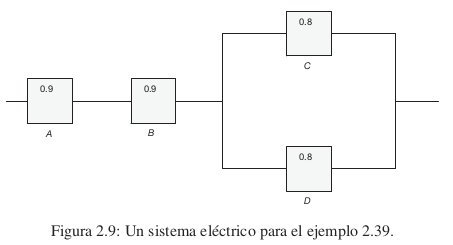
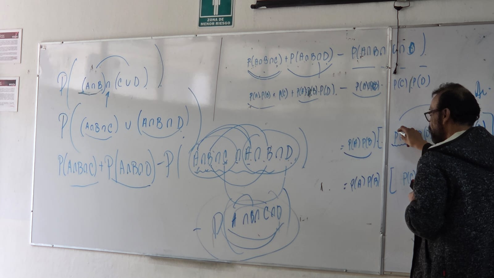
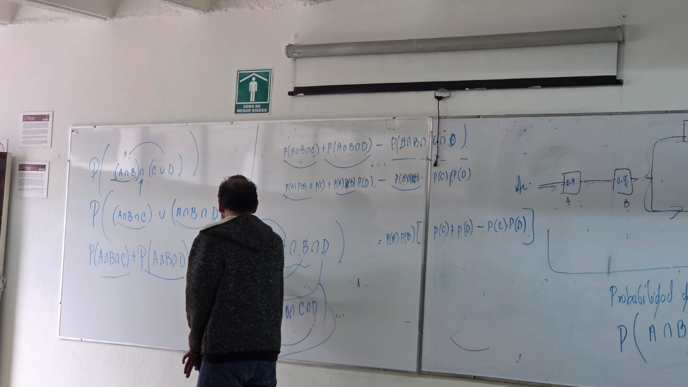
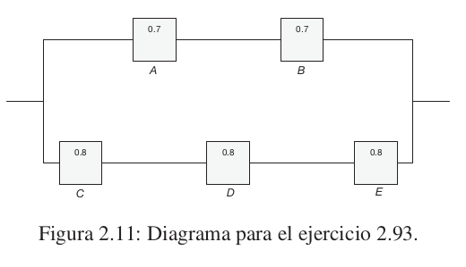

# Probabilidad y Estadística
## Mtro. Pedro García Juárez
Los horarios de asesoría son:
- [Esperando]
- [Esperando]
- 9 - 11

Cubículo: [Esperando]
## Bibliografía
- ["Probabilidad y Estadística para ingenieros y ciencia"](https://github.com/dantecc10/probability-and-statistics/blob/master/8va-probabilidad-y-estadistica-para-ingenier-walpo_260109_092408.pdf "Ver libro")

## Contenidos
Probabilidad y Estadística
Contenidos:
#### Unidad 1:
#### Unidad 2:
#### Unidad 3:
#### Unidad 4:
#### Unidad 5:

## Criterios de evaluación
- Tarea
- Exámenes
- Participación
- Asistencia

**"Todo cuenta".**

## Sesiones
### Viernes 9 de enero
Se empieza a hablar de los criterios de evaluación.

Se habla de la primera tarea: grabar un video de 26 segundos en el que nos presentemos. Esta actividad contará como un examen. La calificación mínima será de un 7 en esta entrega.

#### Enfoques de la probabilidad
La probabilidad tiene varios enfoques, los más relevantes son:
- Clásico
- Frecuencial
- Axiomático
- Subjetivo

Probablemente (90%) el lunes realizaremos el primer *quiz*; sobre el tema **"enfoques de la probabilidad"** para el cual debemos investigar los enfoques de la probabilidad, características de cada uno y enfoques..

#### Espacio muestral
Los espacios muestrales van a depender directamente de un experimento: ¿qué entendemos por experimento?...

[Se pregunta a la clase: no todo aquí es de utilidad].

ChatGPT:
>En probabilidad y estadística, un experimento es un proceso o procedimiento bien definido que, al ejecutarse bajo las mismas condiciones, puede producir diferentes resultados, aunque el conjunto de resultados posibles sea conocido.
>
> Formalmente, un experimento se caracteriza por:
>
>- Ser reproducible: puede repetirse en condiciones similares.
> Tener resultados observables: cada ejecución genera un resultado identificable.
> Incertidumbre en el resultado individual: no se puede predecir con certeza qué resultado ocurrirá antes de realizarlo.
> Conjunto de resultados posibles conocido: dicho conjunto se denomina espacio muestral.
> Ejemplos:
>
>- Lanzar una moneda y observar si cae cara o cruz.
>
>- Medir el tiempo de vida útil de un foco.
>
>- Registrar el número de defectos en un lote de producción.
>
>- Extraer una carta de una baraja.

---

El espacio muestral es un conjunto no vacío con las posibilidades de un experimento y se suele denotar por "S".
Experimento 1:  Usemos el ejemplo de lanzar una moneda y realizar la anotación.
Espacio muestral: S = {"Águila", "Sol"}.

Experimento 2: Lanzar 2 veces un dado y realizar las anotaciones.
S = {(1, 1), (1, 2), (1, 3), (1, 4), (1, 5), (1, 6), ..., (6, 6)}

Los eventos son subconjuntos del espacio muestral, así como el propio espacio muestral de sí mismo.

**Podemos afirmar que**

$$A \subseteq S$$

$$\varnothing \subseteq S$$

$$S \subseteq S$$

El espacio muestral se puede caracterizar por la probabilidad. Son equiprobables si cada evento tiene el mismo peso que todos los demás.
La cardinalidad de un espacio muestral depende del experimento: puede ser finito o infinito.
Algunos espacios muestrales infinitos son numerables, así como todos los finitos. Los infinitos son no numerables.

Los espacios muestrales **numerables** se conocen como **discretos**.

Los espacios muestrales **no numerables** se conocen como **continuos**.

¿Cómo asignar probabilidades?

Antes de asignar probabilidades a los subconjuntos del espacio es necesario obtener probabilidades a cada uno de los elementos del espacio.

Cuando la selección es aleatoria, todos los elementos del espacio muestral tienen la misma probabilidad de ser seleccionados.

**Probabilidad**

$P(S) = 1$

$P(S) = P(e_1) + P(e_2) + P(e_3) + \cdots + P(e_n)$

$P(S) = \sum_{i=1}^{n} P(e_i)$

Cuando se tiene un espacio muestral equiprobable y además es finito:

$$A \subseteq S$$

$$ P(A) = \frac{P(S)}{P(e_i)} $$

Cuando dos conjuntos no tienen elementos en común; son mutuamente excluyentes:

$A \cap B = \varnothing$

$P(A \cup B) = P(A) + P(B)$

$P(S) = P(A \cup A')$

$P(A) + P(A') = 1$

### Lunes 12 de enero

Repaso de los espacios muestrales.

Para poder calcular la probabilidad de B, lo que necesitamos es calcular las probabilidades de cada uno de los elementos que la conforman: $P(B) = P(b_1) + P(b_2) + P(b_3) + \cdots + P(b_n)$

La probabilidad del espacio debe ser siempre 1: $P(S) = 1$

$P(S) = \sum_{i=1}^{\infty} \frac{1}{2}$

Verificación:

$a^3 - b^3 = (a - b)(a^2 + ab + b^2)$

$a^4 - b^4 = (a - b)(a^3 + a^2b + ab^2 + b^3)$

$a^5 - b^5 = (a - b)(a^4 + a^3b + a^2b^2 + ab^3 + b^4)$

\*(Podría ser necesario verificar mis signos).

Ahora, aplicado a la probabilidad:

$1 = 1 + r^1 + r^2 + \cdots + r^{n-1}$

$\lim_{n \to \infty} 1 + r^1 + r^2 + \cdots + r^{n-1}$

### Miércoles 14 de enero

Repaso de la cardinalidad:
A y B son subconjuntos de S:

$A, B \subseteq S$

$P(A) = \frac{Card(A)}{Card(S)}$

¿Cuántos tipos de cardinalidad existen?

$\binom{n}{r} = \frac{n!}{(n-r)!r!}$

$\binom{n}{0} + \binom{n}{1} + \binom{n}{2} + \cdots + \binom{n}{n}$

$(1 + 1)^n = \sum_{i=0}^{n} \binom{n}{i}$

Independientemente de que nosotros tengamos "probable" o "equiprobable" la probabilidad de A siempre va a ser la suma de los pesos.

$P(A) = \sum_{i=0}^{n} P(a_i) | a_i \in A$

A y B son excluyentes:

$\sum_{C \in A}{} P(C) + \sum_{C \in B}{} P(C) = P(A) + P(B)$

$P(A \cup B) = P(A) + P(B) - P(A \cap B)$

$R_1 \cap R_2 = \varnothing$

$P(A) = P(R_1) + P(R_2) + P(R_3) + P(R_4) + P(R_5)$

$R_1 = A - (C \cup B) = A \cap (C \cup B)'$

$P(A \cap B) = P(B) \cdot P(A|B)$

### Viernes 16 de enero del 2026

Entendamos la lectura:

$P (A|B)$ se lee como *"la probabilidad de que ocurra A, dado que ocurrió B"*.

Para el problema de clase:

$A = Río contaminado$

$B = Muestra que sale contaminada$

$C = Se permite pescar$

$P(A) = .3$

$P(B|A) = .75$

$P(B|A') = .2$

$P(C|A \cap B) = .2$

$P(C|A' \cap B) = .15$

$P(C|A \cap B') = .8$

$P(C|A' \cap B') = .9$

### Lunes 19 de enero

Recordando algo de propiedades de conjuntos, sabemos que:

1. $A \cap Y \cap Z = (X \cap Y) \cap Z = X \cap (Y \cap Z)$
2. $X \cap Y = Y \cap X$
3. $X \cap X = X$, $X \cup X = X$
4. $X \subseteq Y \implies X \cap Y = X$
5. $(X \cup Y) \cap Z = X \cap Z \cup Y \cap Z$

$B = (A_i \cap B) \cup (A_2 \cap B) \cup (A_3 \cap B) \cup (A_4 \cap B)$

$C_i = (A_i \cap B), \forall i, j, \in {1, 2, 3, 4}$

$(A_i \cap B) \cap (A_j \cap B) = \varnothing$

$(A \cap C)' = A' \cup C'$

Leemos la página 62 del libro (84 del PDF) sobre la **_Probabilidad Condicional_**.

El lanzar un dado tiene como espacio muestral $S = {1, 2, 3, 4, 5, 6}.$

Eso implica que $P(1) + P(2) + P(3) + P(4) + P(5) + P(6) = 1$.

La probabilidad de los impares: $P(1) = P(3) = P(5)$.

La probabilidad de los pares: $P(2) = P(4) = P(6)$.

$P(1) = P(3) = P(5) = P$, $9P = 1 \implies P = \frac{1}{9}$.

$P(2) = P(4) = P(6) = 2P$, $P = \frac{2}{9}$.

#### ¿Cuál es la probabilidad de que B sea un cuadrado perfecto?

$B = \{1, 4\}$

$P(B) = P(1) + P(4) = \frac{1}{9} + \frac{2}{9} = \frac{3}{9} \frac{1}{3}$

$A = {4, 5, 6}$

$P(A) = P(4) + P(5) + P(6) = \frac{2}{9} + \frac{1}{9} + \frac{2}{9} = \frac{5}{9}$

$P(B|A) = P(4) = \frac{2}{5}$

$P(B|A) = \frac{P(A \cap B)}{P(A)} = \frac{P(4)}{P(A)} = \frac{\frac{2}{9}}{\frac{5}{9}} = \frac{(2)(\cancel{9})}{(5)(\cancel{9})} = \frac{2}{5}$

#### Tarea:
- Teorema de la Probabilidad Total
- Ley del Producto

Traer algún apunte, entenderlo, leerlo. Y así terminó la clase.

### Teorema de la Probabilidad Total
Este teorema calcula la probabilidad de un evento $(A)$ que puede ocurrir a través de múltiples caminos o causas mutuamente excluyentes $(B_i)$, sumando las probabilidades de cada "camino":

$P(A) = \sum_P(A|B_i)P(B_i)$, es decir

la probabilidad de que ocurra cada causa $(P(B_i)) multiplicada por la probabilidad de que $A$ ocurra dado que esa causa ocurrió $((P(A|B_i)))$. Este teorema es útil para descomponer un problema complejo en escenarios más simples, como la probabilidad de que un producto sea defectuoso considerando diferentes máquinas que lo fabrican.

#### Miércoles 21 de enero

##### Nota

El 30 habrá una evaluación de Teams de manera presencial.

Empezamos hablando de los temas que se quedaron de tarea.

$P(B|A) = \frac{P(B \cap A)}{P(A)}$

$P(B \cap A) = P(A) \cdot P(B|A)$

$P(A \cap B) = P(A) \cdot P(B|A)$

Entonces: $P(X \cap Y) = P(Y) \cdot P(X|Y)$ y $P(X \cap Y) = P(X) \cdot P(Y|X)$.

Si $A$ y $B$ son independientes, significa que la ocurrecia de $A$ *no depende de* $B$ y viceversa.

Como sabemos que $A$ y $B$ son independientes decimos que la probabilidad de que $A$ ocurra si $B$ ocurrió es $P(A|B) = P(A)$ y $P(B|A) = P(B)$.

$P(A \cap B) = P(A) \cdot P(B)$

> *"¿Cuándo utilizar suma en un conteo?, ¿cuándo utilizar un producto en un conteo?"*

La parte del producto es simple porque cuando nos piden contar, tenemos que fijarnos en los eventos como tal para saber si ya se terminó el evento o aún no.

Si nos pidieran formar números de 3 cifras, y determinamos la primera, el evento no ha terminado, porque aún faltarían dos.

Cuando algo se ha elegido, cuenta como parte del evento (por ejemplo, sobre el número de 3 cifras).

Regla de producto y regla de la suma en el ámbito de la probabilidad.

La regla de la suma es la suma de las probabilidades de los eventos menos la probabilidad de la intersección:

$P(A \cup B) = P(A) + P(B) - P(A \cap B)$

$P(A \cap B) = P(A) \cdot P(B|A)$

Esto se puede extender a más de dos conjuntos.

Si tenemos 3 conjuntos: $A_1$, $A_2$ y $A_3$:

$P(A_1 \cup A_2 \cup A_3) = P(A_1) + P(A_2) + P(A_3)$

$- [P(A_1 \cap A_2) + P(A_1 \cap A_3) + P(A_2 \cap A_3)]$

$+ P(A_1 \cap A_2 \cap A_3)$

$P(A_1 \cup A_2 \cup A_3 \cup A_4) = P(A_1) + P(A_2) + P(A_3) + P(A_4) - [P(A_1 \cap A_2) + P(A_1 \cap A_3) + P(A_1 \cap A_4) + P(A_2 \cap A_3) + P(A_2 \cap A_4) + P(A_3 \cap A_4)] + [P(A_1 \cap A_2 \cap A_3) + P(A_1 \cap A_2 \cap A_4) + P(A_1 \cap A_3 \cap A_4) + P(A_2 \cap A_3 \cap A_4)]$

$\binom{4}{2} = \frac{4!}{2!2!} = \frac{4 \cdot 3 \cdot 2!}{2!2!} = 6$ Esta es la cantidad de pares de intersecciones que se deben restar

$P(\sum_{i=1}^{k}A_i) = \sum_{i=1}^{K}P(A_i) - \sum_{i, j = 1, 2, 3, \cdots, k}^{} P(A_i \cap A_j) + \sum_{i, j, m \in {1, 2, 3, \cdots, k}}^{} P(A_i \cap A_j \cap A_m) - \sum_{i_1, 1_2, 1_3, 1_4 \in {1, 2, 3, \cdots, k}}{} P(A_{i_1} \cap A_{i_2} \cap A_{i_3} \cap A_{i_j}) +(-1)^{k+1} P(\sum_{i=1}^{k}A_i)$, donde:

$i < j$

Ahora, observamos otras fórmulas en el pizarrón:

$P(A \cap B \cap C) = P(A \cap (B \cap C)) = P(A) \cdot P(B \cap C|A)$

$P(B \cap C) \cdot P(A|B \cap C))$

$P(B) \cdot P(C|B) \cdot P(A|B \cap C)$

Si $A_1, A_2, \cdots, A_k$ son excluyentes:

$A_i \cap A_j = \varnothing, \forall i, j = 1, 2, 3, \cdots, k$, $i \neq j$

Se lee un ejercicio:

> **Ejercicio 2.39**:
> Un sistema eléctrico consta de cuatro componentes, como se ilustra en la figura 2.9. El sistema funciona si los componentes $A$ y $B$ funcionan, y si funciona cualquiera de los componentes $C$ o $D$. La confiabilidad (probabilidad de que funcionen) de cada uno de los componentes también se muestra en la figura 2.9. Calcule la probabilidad de 
> a) que el sistema completo funcione y de
> b) que el componente $C$ no funcione, dado que el sistema completo funciona. Suponga que los cuatro componentes funcionan de manera independiente.

Por el maestro, no pude copiar algunas ecuaciones, las adjunto a continuación y quedo pendiente de la transcripción:

#### Viernes 23 de enero

Retomamos el ejercicio de la sesión anterior.

Consideramos $P[(A \cap B \cap D) \cup (A \cap C \cap D)]$:

$P(X \cup Y) = P(X) + P(Y) - P(X \cap Y)$

$P(A \cap B \cap D) + P(A \cap C \cap D) - P(A \cap B \cap C \cap D)$

$P(A) \cdot P(B) \cdot P(D) + P(A) \cdot P(C) \cdot P(D) - P(A) \cdot P(B) \cdot P(C) \cdot P(D)$

$a \cdot b + a \cdot d - a \cdot e$

Se trabaja el ejercicio 2.93:

> **Ejercicio 2.93**:
> En la figura 2.11 se muestra un sistema de circuitos. SUponga que los componentes fallan de manera independiente.
> a) ¿Cuál es la probabilidad de que el sistema complemento funcione?
> b) Dado que el sistema funciona, ¿cuál es la probabilidad de que el componente $A$ no funcione?

Desarrollo a partir de las dos vías posibles de que el sistema funcione:

$P(A \cap B \cap D) + P(A \cap C \cap D) - P(A \cap B \cap C \cap D)$

$P(A \cap D) \cdot [(P(B) + P(C)) - P(B \cap C)]$

$P(A) \cdot P(D) \cdot [P(B) + P(C) - P(B) \cdot P(C)]$

$P(A) \cdot P(D) \cdot [P(B) \cdot (1 - P(C)) + P(C)]$

$P(A) \cdot P(D) \cdot [P(B) \cdot P(C') + P(C)]$
