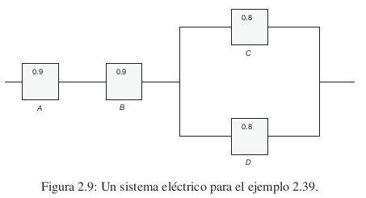
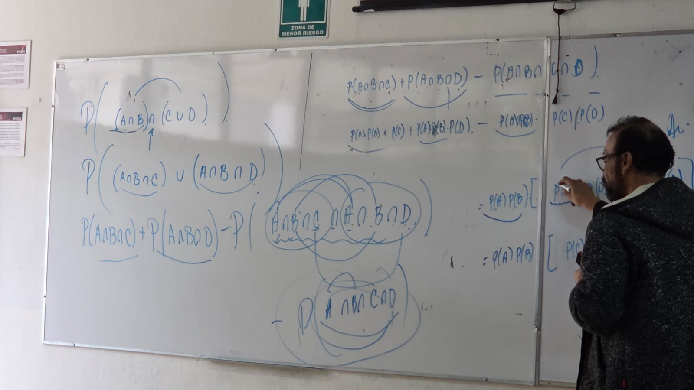
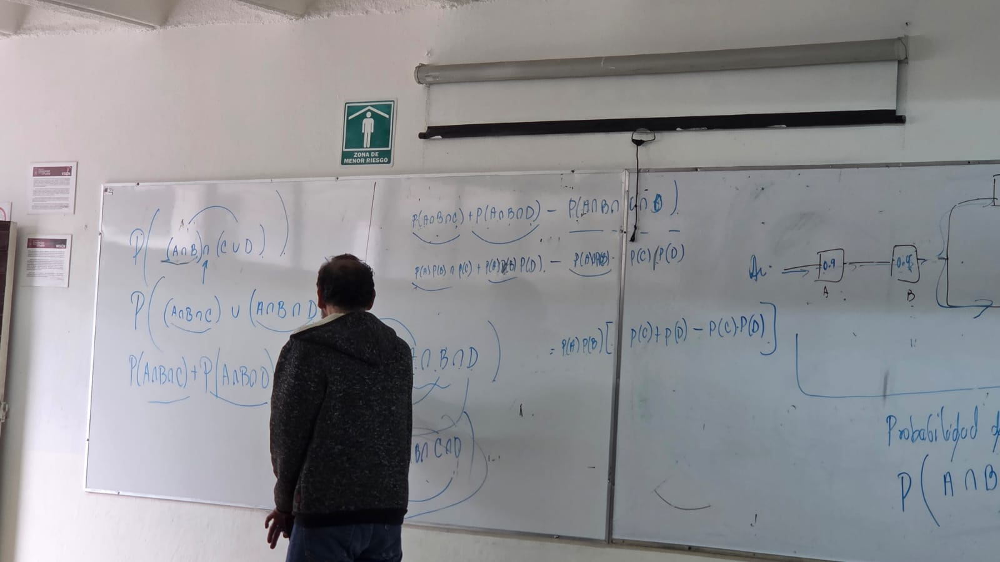
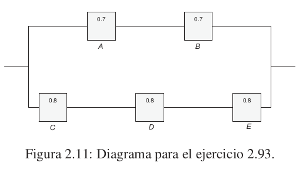

# Probabilidad y Estadística
## Mtro. Pedro García Juárez
Los horarios de asesoría son:
- [Esperando]
- [Esperando]
- 9 - 11

Cubículo: [Esperando]
## Bibliografía
- ["Probabilidad y Estadística para ingenieros y ciencia"](https://github.com/dantecc10/probability-and-statistics/blob/master/8va-probabilidad-y-estadistica-para-ingenier-walpo_260109_092408.pdf "Ver libro")

## Contenidos
Probabilidad y Estadística
Contenidos:
#### Unidad 1:
#### Unidad 2:
#### Unidad 3:
#### Unidad 4:
#### Unidad 5:

## Criterios de evaluación
- Tarea
- Exámenes
- Participación
- Asistencia

**"Todo cuenta".**

## Sesiones
### Viernes 9 de enero
Se empieza a hablar de los criterios de evaluación.

Se habla de la primera tarea: grabar un video de 26 segundos en el que nos presentemos. Esta actividad contará como un examen. La calificación mínima será de un 7 en esta entrega.

#### Enfoques de la probabilidad
La probabilidad tiene varios enfoques, los más relevantes son:
- Clásico
- Frecuencial
- Axiomático
- Subjetivo

Probablemente (90%) el lunes realizaremos el primer *quiz*; sobre el tema **"enfoques de la probabilidad"** para el cual debemos investigar los enfoques de la probabilidad, características de cada uno y enfoques..

#### Espacio muestral
Los espacios muestrales van a depender directamente de un experimento: ¿qué entendemos por experimento?...

[Se pregunta a la clase: no todo aquí es de utilidad].

ChatGPT:
>En probabilidad y estadística, un experimento es un proceso o procedimiento bien definido que, al ejecutarse bajo las mismas condiciones, puede producir diferentes resultados, aunque el conjunto de resultados posibles sea conocido.
>
> Formalmente, un experimento se caracteriza por:
>
>- Ser reproducible: puede repetirse en condiciones similares.
> Tener resultados observables: cada ejecución genera un resultado identificable.
> Incertidumbre en el resultado individual: no se puede predecir con certeza qué resultado ocurrirá antes de realizarlo.
> Conjunto de resultados posibles conocido: dicho conjunto se denomina espacio muestral.
> Ejemplos:
>
>- Lanzar una moneda y observar si cae cara o cruz.
>
>- Medir el tiempo de vida útil de un foco.
>
>- Registrar el número de defectos en un lote de producción.
>
>- Extraer una carta de una baraja.

---

El espacio muestral es un conjunto no vacío con las posibilidades de un experimento y se suele denotar por "S".
Experimento 1:  Usemos el ejemplo de lanzar una moneda y realizar la anotación.
Espacio muestral: S = {"Águila", "Sol"}.

Experimento 2: Lanzar 2 veces un dado y realizar las anotaciones.
S = {(1, 1), (1, 2), (1, 3), (1, 4), (1, 5), (1, 6), ..., (6, 6)}

Los eventos son subconjuntos del espacio muestral, así como el propio espacio muestral de sí mismo.

**Podemos afirmar que**

$$A \subseteq S$$

$$\varnothing \subseteq S$$

$$S \subseteq S$$

El espacio muestral se puede caracterizar por la probabilidad. Son equiprobables si cada evento tiene el mismo peso que todos los demás.
La cardinalidad de un espacio muestral depende del experimento: puede ser finito o infinito.
Algunos espacios muestrales infinitos son numerables, así como todos los finitos. Los infinitos son no numerables.

Los espacios muestrales **numerables** se conocen como **discretos**.

Los espacios muestrales **no numerables** se conocen como **continuos**.

¿Cómo asignar probabilidades?

Antes de asignar probabilidades a los subconjuntos del espacio es necesario obtener probabilidades a cada uno de los elementos del espacio.

Cuando la selección es aleatoria, todos los elementos del espacio muestral tienen la misma probabilidad de ser seleccionados.

**Probabilidad**

$P(S) = 1$

$P(S) = P(e_1) + P(e_2) + P(e_3) + \cdots + P(e_n)$

$P(S) = \sum_{i=1}^{n} P(e_i)$

Cuando se tiene un espacio muestral equiprobable y además es finito:

$$A \subseteq S$$

$$ P(A) = \frac{P(S)}{P(e_i)} $$

Cuando dos conjuntos no tienen elementos en común; son mutuamente excluyentes:

$A \cap B = \varnothing$

$P(A \cup B) = P(A) + P(B)$

$P(S) = P(A \cup A')$

$P(A) + P(A') = 1$

### Lunes 12 de enero

Repaso de los espacios muestrales.

Para poder calcular la probabilidad de B, lo que necesitamos es calcular las probabilidades de cada uno de los elementos que la conforman: $P(B) = P(b_1) + P(b_2) + P(b_3) + \cdots + P(b_n)$

La probabilidad del espacio debe ser siempre 1: $P(S) = 1$

$P(S) = \sum_{i=1}^{\infty} \frac{1}{2}$

Verificación:

$a^3 - b^3 = (a - b)(a^2 + ab + b^2)$

$a^4 - b^4 = (a - b)(a^3 + a^2b + ab^2 + b^3)$

$a^5 - b^5 = (a - b)(a^4 + a^3b + a^2b^2 + ab^3 + b^4)$

\*(Podría ser necesario verificar mis signos).

Ahora, aplicado a la probabilidad:

$1 = 1 + r^1 + r^2 + \cdots + r^{n-1}$

$\lim_{n \to \infty} 1 + r^1 + r^2 + \cdots + r^{n-1}$

### Miércoles 14 de enero

Repaso de la cardinalidad:
A y B son subconjuntos de S:

$A, B \subseteq S$

$P(A) = \frac{Card(A)}{Card(S)}$

¿Cuántos tipos de cardinalidad existen?

$\binom{n}{r} = \frac{n!}{(n-r)!r!}$

$\binom{n}{0} + \binom{n}{1} + \binom{n}{2} + \cdots + \binom{n}{n}$

$(1 + 1)^n = \sum_{i=0}^{n} \binom{n}{i}$

Independientemente de que nosotros tengamos "probable" o "equiprobable" la probabilidad de A siempre va a ser la suma de los pesos.

$P(A) = \sum_{i=0}^{n} P(a_i) | a_i \in A$

A y B son excluyentes:

$\sum_{C \in A}{} P(C) + \sum_{C \in B}{} P(C) = P(A) + P(B)$

$P(A \cup B) = P(A) + P(B) - P(A \cap B)$

$R_1 \cap R_2 = \varnothing$

$P(A) = P(R_1) + P(R_2) + P(R_3) + P(R_4) + P(R_5)$

$R_1 = A - (C \cup B) = A \cap (C \cup B)'$

$P(A \cap B) = P(B) \cdot P(A|B)$

### Viernes 16 de enero del 2026

Entendamos la lectura:

$P (A|B)$ se lee como *"la probabilidad de que ocurra A, dado que ocurrió B"*.

Para el problema de clase:

$A = Río contaminado$

$B = Muestra que sale contaminada$

$C = Se permite pescar$

$P(A) = .3$

$P(B|A) = .75$

$P(B|A') = .2$

$P(C|A \cap B) = .2$

$P(C|A' \cap B) = .15$

$P(C|A \cap B') = .8$

$P(C|A' \cap B') = .9$

### Lunes 19 de enero

Recordando algo de propiedades de conjuntos, sabemos que:

1. $A \cap Y \cap Z = (X \cap Y) \cap Z = X \cap (Y \cap Z)$
2. $X \cap Y = Y \cap X$
3. $X \cap X = X$, $X \cup X = X$
4. $X \subseteq Y \implies X \cap Y = X$
5. $(X \cup Y) \cap Z = X \cap Z \cup Y \cap Z$

$B = (A_i \cap B) \cup (A_2 \cap B) \cup (A_3 \cap B) \cup (A_4 \cap B)$

$C_i = (A_i \cap B), \forall i, j, \in {1, 2, 3, 4}$

$(A_i \cap B) \cap (A_j \cap B) = \varnothing$

$(A \cap C)' = A' \cup C'$

Leemos la página 62 del libro (84 del PDF) sobre la **_Probabilidad Condicional_**.

El lanzar un dado tiene como espacio muestral $S = {1, 2, 3, 4, 5, 6}.$

Eso implica que $P(1) + P(2) + P(3) + P(4) + P(5) + P(6) = 1$.

La probabilidad de los impares: $P(1) = P(3) = P(5)$.

La probabilidad de los pares: $P(2) = P(4) = P(6)$.

$P(1) = P(3) = P(5) = P$, $9P = 1 \implies P = \frac{1}{9}$.

$P(2) = P(4) = P(6) = 2P$, $P = \frac{2}{9}$.

#### ¿Cuál es la probabilidad de que B sea un cuadrado perfecto?

$B = \{1, 4\}$

$P(B) = P(1) + P(4) = \frac{1}{9} + \frac{2}{9} = \frac{3}{9} \frac{1}{3}$

$A = {4, 5, 6}$

$P(A) = P(4) + P(5) + P(6) = \frac{2}{9} + \frac{1}{9} + \frac{2}{9} = \frac{5}{9}$

$P(B|A) = P(4) = \frac{2}{5}$

$P(B|A) = \frac{P(A \cap B)}{P(A)} = \frac{P(4)}{P(A)} = \frac{\frac{2}{9}}{\frac{5}{9}} = \frac{(2)(\cancel{9})}{(5)(\cancel{9})} = \frac{2}{5}$

#### Tarea:
- Teorema de la Probabilidad Total
- Ley del Producto

Traer algún apunte, entenderlo, leerlo. Y así terminó la clase.

### Teorema de la Probabilidad Total
Este teorema calcula la probabilidad de un evento $(A)$ que puede ocurrir a través de múltiples caminos o causas mutuamente excluyentes $(B_i)$, sumando las probabilidades de cada "camino":

$P(A) = \sum_P(A|B_i)P(B_i)$, es decir

la probabilidad de que ocurra cada causa $(P(B_i)) multiplicada por la probabilidad de que $A$ ocurra dado que esa causa ocurrió $((P(A|B_i)))$. Este teorema es útil para descomponer un problema complejo en escenarios más simples, como la probabilidad de que un producto sea defectuoso considerando diferentes máquinas que lo fabrican.

#### Miércoles 21 de enero

##### Nota

El 30 habrá una evaluación de Teams de manera presencial.

Empezamos hablando de los temas que se quedaron de tarea.

$P(B|A) = \frac{P(B \cap A)}{P(A)}$

$P(B \cap A) = P(A) \cdot P(B|A)$

$P(A \cap B) = P(A) \cdot P(B|A)$

Entonces: $P(X \cap Y) = P(Y) \cdot P(X|Y)$ y $P(X \cap Y) = P(X) \cdot P(Y|X)$.

Si $A$ y $B$ son independientes, significa que la ocurrecia de $A$ *no depende de* $B$ y viceversa.

Como sabemos que $A$ y $B$ son independientes decimos que la probabilidad de que $A$ ocurra si $B$ ocurrió es $P(A|B) = P(A)$ y $P(B|A) = P(B)$.

$P(A \cap B) = P(A) \cdot P(B)$

> *"¿Cuándo utilizar suma en un conteo?, ¿cuándo utilizar un producto en un conteo?"*

La parte del producto es simple porque cuando nos piden contar, tenemos que fijarnos en los eventos como tal para saber si ya se terminó el evento o aún no.

Si nos pidieran formar números de 3 cifras, y determinamos la primera, el evento no ha terminado, porque aún faltarían dos.

Cuando algo se ha elegido, cuenta como parte del evento (por ejemplo, sobre el número de 3 cifras).

Regla de producto y regla de la suma en el ámbito de la probabilidad.

La regla de la suma es la suma de las probabilidades de los eventos menos la probabilidad de la intersección:

$P(A \cup B) = P(A) + P(B) - P(A \cap B)$

$P(A \cap B) = P(A) \cdot P(B|A)$

Esto se puede extender a más de dos conjuntos.

Si tenemos 3 conjuntos: $A_1$, $A_2$ y $A_3$:

$P(A_1 \cup A_2 \cup A_3) = P(A_1) + P(A_2) + P(A_3)$

$- [P(A_1 \cap A_2) + P(A_1 \cap A_3) + P(A_2 \cap A_3)]$

$+ P(A_1 \cap A_2 \cap A_3)$

$P(A_1 \cup A_2 \cup A_3 \cup A_4) = P(A_1) + P(A_2) + P(A_3) + P(A_4) - [P(A_1 \cap A_2) + P(A_1 \cap A_3) + P(A_1 \cap A_4) + P(A_2 \cap A_3) + P(A_2 \cap A_4) + P(A_3 \cap A_4)] + [P(A_1 \cap A_2 \cap A_3) + P(A_1 \cap A_2 \cap A_4) + P(A_1 \cap A_3 \cap A_4) + P(A_2 \cap A_3 \cap A_4)]$

$\binom{4}{2} = \frac{4!}{2!2!} = \frac{4 \cdot 3 \cdot 2!}{2!2!} = 6$ Esta es la cantidad de pares de intersecciones que se deben restar

$P(\sum_{i=1}^{k}A_i) = \sum_{i=1}^{K}P(A_i) - \sum_{i, j = 1, 2, 3, \cdots, k}^{} P(A_i \cap A_j) + \sum_{i, j, m \in {1, 2, 3, \cdots, k}}^{} P(A_i \cap A_j \cap A_m) - \sum_{i_1, 1_2, 1_3, 1_4 \in {1, 2, 3, \cdots, k}}{} P(A_{i_1} \cap A_{i_2} \cap A_{i_3} \cap A_{i_j}) +(-1)^{k+1} P(\sum_{i=1}^{k}A_i)$, donde:

$i < j$

Ahora, observamos otras fórmulas en el pizarrón:

$P(A \cap B \cap C) = P(A \cap (B \cap C)) = P(A) \cdot P(B \cap C|A)$

$P(B \cap C) \cdot P(A|B \cap C))$

$P(B) \cdot P(C|B) \cdot P(A|B \cap C)$

Si $A_1, A_2, \cdots, A_k$ son excluyentes:

$A_i \cap A_j = \varnothing, \forall i, j = 1, 2, 3, \cdots, k$, $i \neq j$

Se lee un ejercicio:

> **Ejercicio 2.39**:
> Un sistema eléctrico consta de cuatro componentes, como se ilustra en la figura 2.9. El sistema funciona si los componentes $A$ y $B$ funcionan, y si funciona cualquiera de los componentes $C$ o $D$. La confiabilidad (probabilidad de que funcionen) de cada uno de los componentes también se muestra en la figura 2.9. Calcule la probabilidad de 
> a) que el sistema completo funcione y de
> b) que el componente $C$ no funcione, dado que el sistema completo funciona. Suponga que los cuatro componentes funcionan de manera independiente.

Por el maestro, no pude copiar algunas ecuaciones, las adjunto a continuación y quedo pendiente de la transcripción:

#### Viernes 23 de enero

Retomamos el ejercicio de la sesión anterior.

Consideramos $P[(A \cap B \cap D) \cup (A \cap C \cap D)]$:

$P(X \cup Y) = P(X) \cup P(Y) \setminus P(X \cap Y)$

$P(A \cap B \cap D) + P(A \cap C \cap D) - P(A \cap B \cap C \cap D)$

$P(A) \cdot P(B) \cdot P(D) + P(A) \cdot P(C) \cdot P(D) - P(A) \cdot P(B) \cdot P(C) \cdot P(D)$

$a \cdot b + a \cdot d - a \cdot e$

Se trabaja el ejercicio 2.93:

> **Ejercicio 2.93**:
> En la figura 2.11 se muestra un sistema de circuitos. SUponga que los componentes fallan de manera independiente.
> a) ¿Cuál es la probabilidad de que el sistema complemento funcione?
> b) Dado que el sistema funciona, ¿cuál es la probabilidad de que el componente $A$ no funcione?

Desarrollo a partir de las dos vías posibles de que el sistema funcione:

$P(A \cap B \cap D) \cup P(A \cap C \cap D) \setminus P(A \cap B \cap C \cap D)$

$P(A \cap D) \cdot [(P(B) \cup P(C)) \setminus P(B \cap C)]$

$P(A) \cdot P(D) \cdot [P(B) + P(C) - P(B) \cdot P(C)]$

$P(A) \cdot P(D) \cdot [P(B) \cdot (1 - P(C)) + P(C)]$

$P(A) \cdot P(D) \cdot [P(B) \cdot P(C') + P(C)]$

Y ahora, sustituyo las probabilidades establecidas para obtener un valor:

$(x) \cdot (y)$

Pues, estaba resolviendo bien, pero con la imagen equivocada. A continuación, el desarrollo para este ejericio, pero tomando como referencia la figura 2.11:

La probabilidad de que el sistem funcione, sería la suma (unión) de las probabilidades de ambos caminos menos la intersección de (para evitar reundancias) de las intersecciones 1 a 1 que se combinarían como $(A \cap B \cap C \cap D \cap E)$.

Queda:

$(A \cap B) \cup (C \cap D \cap E) \setminus (A \cap B \cap C \cap D \cap E)$

Esto se puede desarrollar como:

$(P(A) \cdot P(B)) + (P(C) \cdot P(D) \cdot P(E)) \setminus (P(A) \cdot P(B) \cdot P(C) \cdot P(D) \cdot P(E))$

Y sean

$P(A) = .7$

$P(B) = .7$

$P(C) = .8$

$P(D) = .8$

$P(E) = .8$

sustituyo:
$(.7) \cdot (.7) + (.8) \cdot (.8) \cdot (.8) - (.7) \cdot (.7) \cdot (.8) \cdot (.8) \cdot (.8)$

Usemos potencias:

$(.7)^2 + (.8)^3 - (.7)^2 \cdot (.8)^3 = (.49) + (.512) - (.49) \cdot (.512) = (1.002) - (.25088) = (.75112)$

Por lo tanto, la probabilidad de que el sistema funcione con cualquiera de los dos caminos, es de $(.755112)$. Esto es la respuesta al inciso *a)*.

El inciso *b)*, nos pide una probabilidad condicional. **Dado que el sistema funciona**, ¿cuál es la probabilidad de que el componente **$A$ no funcione**?

Que $A$ no funcione, equivale a $A'$.

Entonces, la expresión que nos dará el valor que buscamos es:

$P(A' | (A \cap B) \cup (C \cap D \cap E) \setminus (A \cap B \cap C \cap D \cap E))$

Esto lo vamos a representar como:

$P(A' | (A \cap B) \cup (C \cap D \cap E) \setminus (A \cap B \cap C \cap D \cap E)) = \frac{P(A' \cap ((A \cap B) \cup (C \cap D \cap E) \setminus (A \cap B \cap C \cap D \cap E)))}{P((A \cap B) \cup (C \cap D \cap E) \setminus (A \cap B \cap C \cap D \cap E))}$

Ahora, aunque la fórmula parece bastante densa, se simplifica considerando el valor previo que había obtenido para $(A \cap B) \cup (C \cap D \cap E) - (A \cap B \cap C \cap D \cap E)$, que es $.75112$. Sustituyo:

$P((1 - .7) | (.75112)) = \frac{(1 - .7) \cdot (.75112)}{(.75112)}$

Desarrollando:

$P((.3) | (.75112)) = \frac{(.3) \cdot \color{gray}{(.75112)}}{\color{gray}{(.75112)}}$

$\therefore P((.3) | (.75112)) = (.3)$. Esto sería la respuesta al inciso *b)*.

*Uso el color gris en la fórmula de arriba para representar un elemento que se está cancelando dadas las limitaciones de la renderización a través de Markdown en GitHub.

Ahora, debo resolver el **_Ejercicio 2.94_**. Este se responde con mucha facilidad partiendo de la solución del inciso _a)_ del **_Ejercicio 2.93_**, pero lo pospondré para el fin de semana.

**Ejercicio 2.94**:
> En la situación del **_ejercicio 2.93_** se sabe que el sistema no funciona. ¿Cuál es la probabilidad de que el componente A tampoco funcione?

Para resolver, debemos plantear una expresión acorde a la pregunta:

#### Ejercicios de tarea

**Ejercicio 2.2**:
> Utilice el método de la regla para describir el espacio muestral $S$, que consta de todos los puntos del primer cuadrante dentro de un círculo de radio 3 con centro en el origen.

_Solución_:

Con el _método de la regla_ definimos el conjunto solución usando expresiones matemáticas que deben cumplir los puntos $(x, y)$. Un círculo con centro en el origne y radio 3 tiene la ecuación $x^2 + y^2 = 3^2$. Ser solución implica la desigualdad $\leq 9$, y el primer cuadrante implica que tanto $x$, como $y$ son positivos ($>0$).

$S = \\{(x, y) | x^2 + y^2 < 9, x > 0, y > 0\\}$.

**Ejercicio 2.3**:
> ¿Cuáles de los siguientes eventos son iguales?
>
> a) $A = \\{1, 3\\}$;
>
> b) $B = \\{x | x es un número de un dado\\}$;
>
> c) $C = \\{x | x^2 - 4x + 3 = 0\\}$;
>
> d) $D = \\{x | x$ es el número de caras cuando se lanzan seis monedas al aire $\\}$.

**Ejercicio 2.4**:
> Un experimento implica lanzar un par de dados, uno verde y uno rojo, y al registrar los números que resultan. Si $x$ es igual al resultado en el dado verde y $y$ es el resultado en el dado rojo, describa el espacio muestral $S$
>
> a) mediante la lista de los elementos $(x, y)$;
>
> b) por medio del método de la regla.

_Solución_:

$$
S = \\{(1, 1), (1, 2), (1, 3), (1, 4), (1, 5), (1, 6),
	(2, 1), (2, 2), (2, 3), (2, 4), (2, 5), (2, 6),
	(3, 1), (3, 2), (3, 3), (3, 4), (3, 5), (3, 6),
	(4, 1), (4, 2), (4, 3), (4, 4), (4, 5), (4, 6),
	(5, 1), (5, 2), (5, 3), (5, 4), (5, 5), (5, 6),
	(6, 1), (6, 2), (6, 3), (6, 4), (6, 5), (6, 6)
 \\}$$

**Ejercicio 2.5**:
> Un experimento consiste en lanzar un dadod y después lanzar una moneda una vez si el número en el dado es par. Si el número en el dado es impar, la moneda se lanza dos veces. Use la notación $4H$, por ejemplo, para denotar el resultado de que el dado muestre 4 y después la moneda caiga en cara, y $3HT$ para denotar el resultado de que el dado muestre 3, seguido por una cara y después una cruz en la moneda; construya un diagrama de árbol para mostrar los 18 elementos del espacio muestral $S$.

**Ejercicio 2.6**: 
> De un grupo de cuatro suplentes se seleccionan dos jurados para servir en un juicio por homicidio. Utilice la notación $A_1 A_3$, por ejemplo, para denotar el evento simple de que se seleccionen los suplentes 1 y 3, liste los 6 elementos del espacio muestral $S$.

**Ejercicio 2.7**:
> De un grupo de estudiantes de química se seleccionan cuatro al azar y se clasifican como hombre o mujer. Liste los elementos del espacio muestral $S_1$ usando la letra $H$ para hombre y $M$ para mujer. Defina un segundo espacio muestral $S_2$ donde los elementos representen el número de mujeres seleccionadas.

**Ejercicio 2.8**:
> Para el espacio muestral del *ejercicio 2.4*,
>
> a) liste los elementos que corresponden al evento $A$ de que la suma sea mayor que 8;
>
> b) liste los elementos que corresponden al evento $B$ de que ocurra un 2 en cualquiera de los dos dados;
>
> c) liste los elementos que corresponden al evento $C$ de que salga un número mayor que 4 en el dado verde;
> 
> d) liste los elementos que corresponden al evento $A \cap C$;
>
> e) liste los elementos que corresponden al evento $A \cap B$;
>
> f) liste los elementos que corresponden al evento $B \cap C$;
> 
> g) construya un diagrama de Venn para ilustrar las intersecciones y uniones de los eventos $A$, $B$ y $C$.

_Solución_:

a) Son los elementos:

$A = \\{(3, 6), (4, 5), (4, 6), (5, 4), (5, 5), (5, 6), (6, 3), (6, 4), (6, 5), (6, 6)  \\}$

b) Serían los elementos:

$B = \\{ (1, 2), (2, 1), (2, 2), (2, 3), (2, 4), (2, 5), (2, 6), (3, 2), (4, 2), (5, 2), (6, 2) \\}$

c) Serían los elementos:

$C = \\{(5, 1), (5, 2), (5, 3), (5, 4), (5, 5), (5, 6), (6, 1), (6, 2), (6, 3), (6, 4), (6, 5), (6, 6) \\}$

d) Serían:

$A \cap C = \\{ (5, 4), (5, 5), (5, 6), (6, 3), (6, 4), (6, 5), (6, 6) \\}$

e) Serían:

$A \cap B = \\{ \varnothing \\}$

f) Son:

$B \cap C = \\{ (5, 2), (6, 2) \\}$

g) Construir un diagrama de Venn es imposible usando sólo markdown. Dejo pendiente esta solución hasta encontrar la forma de generarlos a través de una librería e insertarlos como imagen según corresponde.

Aún así puedo escribir las intersecciones basándome en las respuestas a los demás incisos:

$A = \\{(3, 6), (4, 5), (4, 6), (5, 4), (5, 5), (5, 6), (6, 3), (6, 4), (6, 5), (6, 6)  \\}$

$B = \\{ (1, 2), (2, 1), (2, 2), (2, 3), (2, 4), (2, 5), (2, 6), (3, 2), (4, 2), (5, 2), (6, 2) \\}$

$C = \\{(5, 1), (5, 2), (5, 3), (5, 4), (5, 5), (5, 6), (6, 1), (6, 2), (6, 3), (6, 4), (6, 5), (6, 6) \\}$

$A \cap B = \\{ \varnothing \\}$

$A \cap C = \\{ (5, 4), (5, 5), (5, 6), (6, 3), (6, 4), (6, 5), (6, 6) \\}$

$B \cap C = \\{ (5, 2), (6, 2) \\}$

Falta $A \cap B \cap C$:

$A \cap B \cap C = \\{ \varnothing \\}$

**Ejercicio 2.9**:
> Para el espacio muestral del ejercicio 2.5,
>
> a) liste los elementos que corresponden al evento $A$ en el que el dado salga un número menor que 3;
>
> b) liste los elementos que corresponden al evento $B$ de que resulten 2 cruces;
> 
> c) liste los elementos que corresponden al evento $A'$;
>
> d) liste los elementos que corresponden al evento $A' \cap B$;
>
> e) liste los elementos que corresponden al evento $A \cup B$.

**Ejercicio 2.10**:
> Se contrata a una empresa de ingenieros para que determine si ciertas vías fluviales en Virginia, Estaods Unidos, son seguras para la pesca. Se toman muestras de tres ríos.
>
> a) Liste los elementos de un espacio muestral $S$ y utilice las letras $P$ para "seguro para la pesca" y $N$ para "inseguro para la pesca".
>
> b) Liste los elementos de $S$ que correspondan al evento $E$ de que al menos dos de los ríos son seguros para la pesca.
>
> c) Defina un evento que tiene como elementos a los puntos $\\{PPP, NPP, PPN, NPNP\\}$

### Miércoles 4 de febrero

**Ejercicio 2.21**:

> A los participantes de una convención se les ofrecen seis recorridos, cada uno de tres días, a sitios de interés. ¿De cuántas maneras se puede acomodar una persona para que vaya a uno de los recorridos planeados por la convención?

De 6, porque es a una persona:

**Ejercicio 2.22**:

> "En un estudio médico los pacientes se clasifican en 8 formas de acuerdo con su tipo sanguíneo: $AB^+$, $AB^-$, $A^+$, $B^+$, $B^-$, $O^+$ u $O^-$; y también de acuerdo con su presión sanguínea: baja, nomral, o alta. Encuentre el número de formas en las que se puede clasificar a un paciente".

La respuesta es 24: $8$ tipos de sangre por $3$ posibles niveles de presión.

**Ejercicio 2.23**:

> "Si un experimento consiste en lanzar un dado y después extraer una letra al azar del alfabeto inglés, ¿cuántos puntos habŕa en el espacio muestral?"

La respuesta es 162 (para el alfabeto español): $6$ lados del dado por $27$ posibles letras.

**Ejercicio 2.24**:

> "Los estudiantes de humanidades de una universidad privada se clasifican como estudiantes de primer año, de segundo año, de penúltimo año o de último año, y también de acuerdo con su género (hombres o mujeres). Calcule el número total de clasificaciones posibles para los estudiantes de esa universidad."

$4 \cdot 6 = 24$

**Ejercicio 2.26**:

> "Un estudio en California concluyó que siguiendo siete snecillas reglas para la salud un hombre y una mujer puede prolongar su vida 11 y 7 años en promedio, respectivamente. Estas 7 reglas son: no fumar, hacer ejercicio de manera habitual, moderar su consumo de alcohol, dormir siete u ocho horas, mantener el peso"

**Ejercicio 2.27**:

> "Un urbanista de un nuevo fraccionamiento ofrece a un posible comprador de una casa elegir entre 4 diseños, 3 diferentes sistemas de calefacción, un garaje o cobertizo, y un patio o un porche cubierto. ¿De cuántos planos diferentes dispone el comprador?"

Los planos de los que dispone el comprador son $48$,

$4 \cdot 3 \cdot 2 \cdot 2$; lo que corresponde a

- 4 diseños
- 3 diferentes sistemas de calefacción
- un garaje o cobertizo (2 opciones)
- y un patio o porche cubierto (otras 2 opciones)
 
**Ejercicio 2.42**:

> "De un grupo de 40 boletos se sacan 3 billetes de lotería para el primero, segundo y tercer premios. Encuentre el número de puntos muestrales en $S$ para dar los 3 premios, si cada concursante sólo tiene un billete".

Los puntos muestrales en $S$ para sacar los boletos premiados son $40 \cdot 39 \cdot 38 = 59280$, puesto que

- es equiprobable sacar cualquier boleto para el primer lugar;
- para luego sacar el segundo descartando el que haya salido en la primera, y
- luego sacar el tercero habiendo descartado ya dos boletos de la totalidad de estos.

### Viernes 6 de febrero

Nos pidieron resolver el problema:

**Ejercicio 2.48**:

> _"¿Cuántas formas hay en que dos estudiantes no tengan la misma fecha de cumpleaños en un grupo de 60?"_

Empezaré planteando que hay 365 -considerando un año no bisiesto- posibles cumpleaños para cada persona.

Y que hay 60 personas.

Por ello, la posibilidad de que una persona cumpla en un día aleatorio o determinado del año es de $365 \cdot 60$. 

Si $365!$ nos permite determinar la cantidad de acomodos de fechas del año sin repetición, pero sólo queremos 60, la expresión sería:

$(365-(365-60))!$

$(365-(305))! = (365-305) = 60!$

Hsata aquí, creo que está mal....

En lenguaje natural, planteo que una solución es "las primeras 60 multiplicaciones" del factorial de 365. Porque esto generaría fechas no repetidas. Sobrarían elementos dentro de los días del año, pero evidentemente 60 personas no pueden cubrir un calendario de 365 días, lo cual es una señal de que se va en buen sentido.

Creo que el planteamiento del problema podría ser reformulado a:

> _"¿Cuantas formas posibles hay de **asignar** una fecha de cumpleaños distinta a cada uno de los 60 estudiantes de un grupo? Considerando que *asignar* una fecha de cumpleaños no es posible, pero permite cumplir con la condición de que no se repita ningún cumpleaños."_

Yo plantearía una solución práctica, siguiendo con mi idea de _"las primeras multiplicaciones de un factorial de 365"_:

> _"Si tengo anotados en 365 papelitos los 365 días del año, y los reparto a un grupo de 60 estudiantes, pasando a sus lugares, y teniendo los papeles al azar u ordenados (para esta condición no importa). Todos tendrán un día del año"._

De esto podemos saber que:
- Los papeles serán diferentes
- Por lo anterior, se cumple que *"dos estudiantes no tengan la misma fecha de cumpleaños en un grupo de 60"*.

Matemáticamente, las posibilidades de asignar a cada uno un día, serían:
| Estudiante  | Posibles días de cumpleaños |
| :-: | :-: |
| 1 | 365 |
| 2 | 364 |
| 3 | 363 |
| 4 | 362 |
| 5 | 361 |
| 6 | 360 |
| 7 | 359 |
| 8 | 358 |
| 9 | 357 |
| 10 | 356 |
| 11 | 355 |
| 12 | 354 |
| 13 | 353 |
| 14 | 352 |
| 15 | 351 |
| 16 | 350 |
| 17 | 349 |
| 18 | 348 |
| 19 | 347 |
| 20 | 346 |
| 21 | 345 |
| 22 | 344 |
| 23 | 343 |
| 24 | 342 |
| 25 | 341 |
| 26 | 340 |
| 27 | 339 |
| 28 | 338 |
| 29 | 337 |
| 30 | 336 |
| 31 | 335 |
| 32 | 334 |
| 33 | 333 |
| 34 | 332 |
| 35 | 331 |
| 36 | 330 |
| 37 | 329 |
| 38 | 328 |
| 39 | 327 |
| 40 | 326 |
| 41 | 325 |
| 42 | 324 |
| 43 | 323 |
| 44 | 322 |
| 45 | 321 |
| 46 | 320 |
| 47 | 319 |
| 48 | 318 |
| 49 | 317 |
| 50 | 316 |
| 51 | 315 |
| 52 | 314 |
| 53 | 313 |
| 54 | 312 |
| 55 | 311 |
| 56 | 310 |
| 57 | 309 |
| 58 | 308 |
| 59 | 307 |
| 60 | 306 |

La cantidad de formas posibles para que nadie repita fecha de cumpleaños sería:

Formas posibles de no repetir fecha de cumpleaños: $(365 \cdot 364 \cdot 363 \cdot 362 \cdot 361 \cdot 360 \cdot 359 \cdot 358 \cdot 357 \cdot 356 \cdot 355 \cdot 354 \cdot 353 \cdot 352 \cdot 351 \cdot 350 \cdot 349 \cdot 348 \cdot 347 \cdot 346 \cdot 345 \cdot 344 \cdot 343 \cdot 342 \cdot 341 \cdot 340 \cdot 339 \cdot 338 \cdot 337 \cdot 336 \cdot 335 \cdot 334 \cdot 333 \cdot 332 \cdot 331 \cdot 330 \cdot 329 \cdot 328 \cdot 327 \cdot 326 \cdot 325 \cdot 324 \cdot 323 \cdot 322 \cdot 321 \cdot 320 \cdot 319 \cdot 318 \cdot 317 \cdot 316 \cdot 315 \cdot 314 \cdot 313 \cdot 312 \cdot 311 \cdot 310 \cdot 309 \cdot 308 \cdot 307 \cdot 306)$

$= 32118000000000000000000000000000000000000000000000000000000000000000000000000000000000000000000000000000000000000000000000000000000000000000$ posibilidades

O, mejor expresado: $3.12118 \cdot 10^{151}$

Se queda de tarea el ejercicio 2.48, el principio del palomar, y principios de inclusión y exclusión.

#### Otra nota

$x = y^2$

### Miércoles 4 de marzo

Suponemos que tenemos lista nuestra función de distribución conjunta:

$f(x, y)$

Y nos piden determinar a partir de esta dos funciones $g(x)$ y $h(y)$ y se puedan obtener las funciones de probabilidad para cada una de las variables aleatorias.

Hay que encontrar las _**distribuciones marginales**_.

Si ambas son discretas o ambas son continuas es posible realizar un cálculo.

En el caso discreto:

Si queremos obtener una función de la función conjunta para la variable aleatoria $x$ debemos hacer la sumatoria a modo de que quede libre sólo la variable $x$. Algo como:

$\sum_{x} f(x, y)$

Para el caso continuo:

$g(x) = \int_{-a}^{a} f(x, y)dy$

y 

$h(y) = \int_{- \infty}^{\infty} f(x, y)dx$

$x$, $y$ con distrubución conjunta:

$P(X|Y) = \frac{f(x,y)}{h(y)}$

$x$, $y$ son independientes **sí y sólo sí**:

$f(x, y) = g(x) \cdot h(y)$

Se resuelve un problema:

a. $f(x, y) = cxy$

$$
\begin{cases}
x = 1, 2, 3 \\
y = 1, 2, 3
\end{cases}
$$

$a < c$

$\sum_{y=1}^{a} \sum_{x=1}^{a} xy$

Problema **3.38**:

> "Si la distribución de probabilidad conjunta de X y Y está dada por
>
> $f(x, y) = \frac{x+y}{30}$, para $x = 0, 1, 2, 3$; $y = 0, 1, 2$, calcule
>
> a) $P(X \leq 2, Y = 1)$;
>
> b) $P(X > 2, Y \leq 1)$;
>
> c) $P(X > Y)$;
>
> d) $P(X + Y = 4)$
